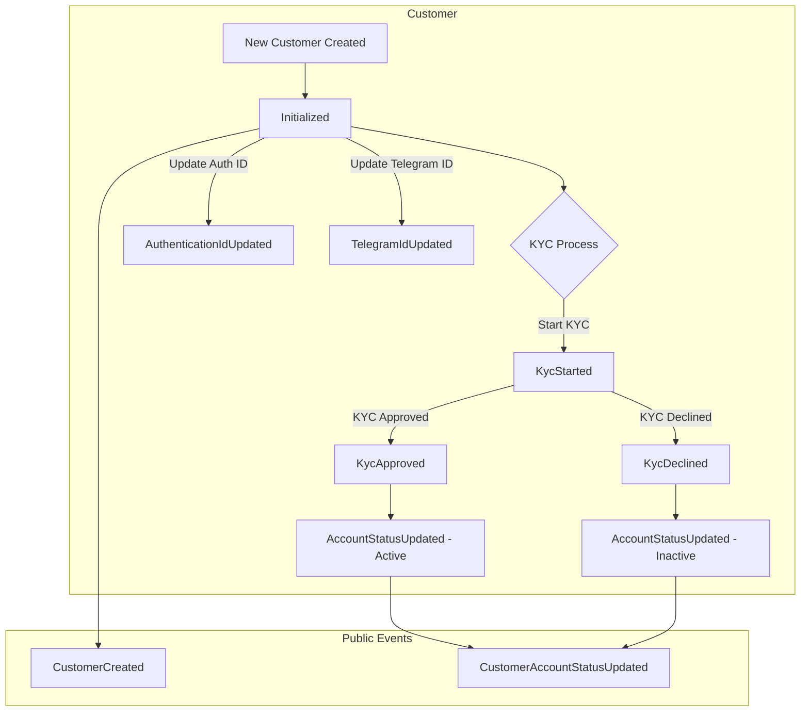
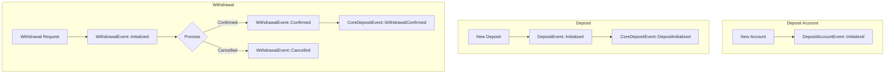
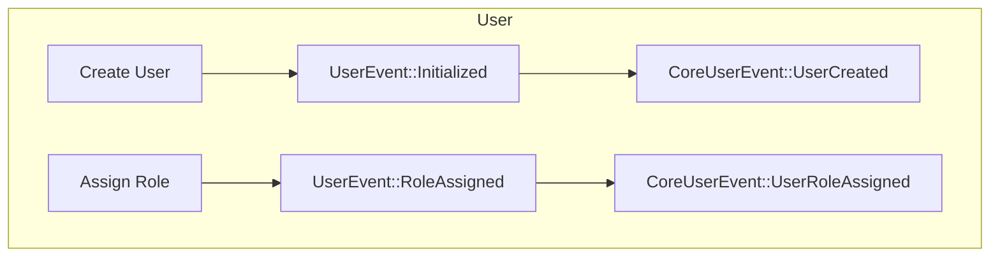
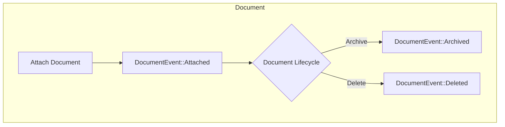
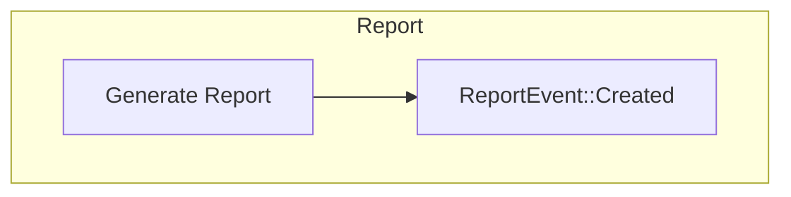
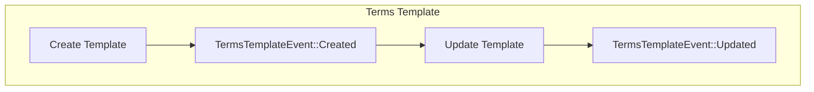
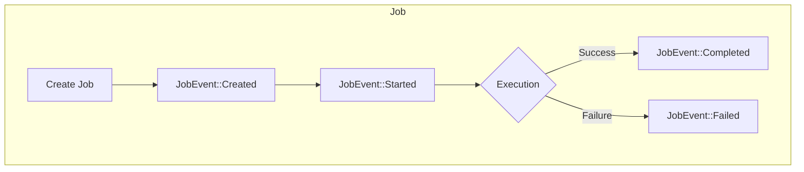
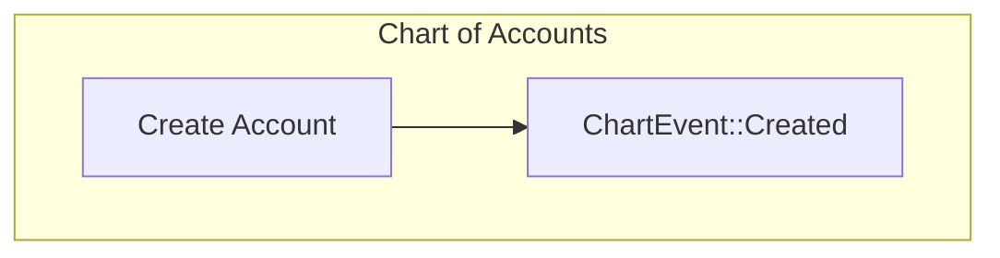

# LANA Bank Events

This document catalogs all events in the LANA Bank system, both public and private, and provides flow charts for each event type.

## Table of Contents

- [Customer Events](#customer-events)
- [Deposit Events](#deposit-events)
- [Credit Events](#credit-events)
- [Governance Events](#governance-events)
- [User Events](#user-events)

## Customer Events

### Public Events (CoreCustomerEvent)

| Event | Properties |
| ----- | ---------- |
| CustomerCreated | id: CustomerId, email: String, customer_type: CustomerType |
| CustomerAccountStatusUpdated | id: CustomerId, status: AccountStatus |

### Private Events (CustomerEvent)

| Event | Properties |
| ----- | ---------- |
| Initialized | id: CustomerId, email: String, telegram_id: String, customer_type: CustomerType, audit_info: AuditInfo |
| AuthenticationIdUpdated | authentication_id: AuthenticationId |
| KycStarted | applicant_id: String, audit_info: AuditInfo |
| KycApproved | applicant_id: String, level: KycLevel, audit_info: AuditInfo |
| KycDeclined | applicant_id: String, audit_info: AuditInfo |
| AccountStatusUpdated | status: AccountStatus, audit_info: AuditInfo |
| TelegramIdUpdated | telegram_id: String, audit_info: AuditInfo |

### Customer Event Flow

## Deposit Events

### Public Events (CoreDepositEvent)

| Event | Properties |
| ----- | ---------- |
| DepositInitialized | id: DepositId, deposit_account_id: DepositAccountId, amount: UsdCents |
| WithdrawalConfirmed | id: WithdrawalId, deposit_account_id: DepositAccountId, amount: UsdCents |

### Private Events (DepositEvent)

| Event | Properties |
| ----- | ---------- |
| Initialized | id: DepositId, ledger_transaction_id: CalaTransactionId, deposit_account_id: DepositAccountId, amount: UsdCents, reference: String, audit_info: AuditInfo |

### Private Events (DepositAccountEvent)

| Event | Properties |
| ----- | ---------- |
| Initialized | id: DepositAccountId, customer_id: CustomerId, audit_info: AuditInfo |

### Private Events (WithdrawalEvent)

| Event | Properties |
| ----- | ---------- |
| Initialized | id: WithdrawalId, deposit_account_id: DepositAccountId, requested_amount: UsdCents, audit_info: AuditInfo |
| Confirmed | audit_info: AuditInfo, ledger_transaction_id: CalaTransactionId, final_amount: UsdCents |
| Cancelled | audit_info: AuditInfo, reason: String |

### Deposit Event Flow

## Credit Events

### Public Events (CoreCreditEvent)

| Event | Properties |
| ----- | ---------- |
| CreditFacilityCreated | id: CreditFacilityId, customer_id: CustomerId, amount: UsdCents |
| CreditFacilityDisbursalInitiated | id: DisbursalId, credit_facility_id: CreditFacilityId, requested_amount: UsdCents |
| CreditFacilityTermsUpdated | id: CreditFacilityId, terms: Vec<TermValue> |
| InterestAccrued | credit_facility_id: CreditFacilityId, amount: UsdCents, accrual_cycle_id: InterestAccrualCycleId |
| CreditFacilityPaymentInitiated | id: PaymentId, credit_facility_id: CreditFacilityId, amount: UsdCents, interest_repayment_amount: UsdCents, principal_repayment_amount: UsdCents |

### Private Events (CreditFacilityEvent)

| Event | Properties |
| ----- | ---------- |
| Initialized | id: CreditFacilityId, customer_id: CustomerId, audit_info: AuditInfo, requested_amount: UsdCents |
| TermsUpdated | terms: Vec<TermValue>, audit_info: AuditInfo |
| Disbursed | disbursal_id: DisbursalId, amount_disbursed: UsdCents, audit_info: AuditInfo |
| InterestAccrued | amount: UsdCents, accrual_cycle_id: InterestAccrualCycleId, audit_info: AuditInfo |
| PaymentReceived | payment_id: PaymentId, amount: UsdCents, interest_repayment_amount: UsdCents, principal_repayment_amount: UsdCents, audit_info: AuditInfo |
| CollateralUpdated | collateral_price: UsdCents, audit_info: AuditInfo |

### Private Events (DisbursalEvent)

| Event | Properties |
| ----- | ---------- |
| Initialized | id: DisbursalId, credit_facility_id: CreditFacilityId, requested_amount: UsdCents, audit_info: AuditInfo |
| Approved | final_amount: UsdCents, audit_info: AuditInfo |
| Rejected | reason: String, audit_info: AuditInfo |
| Executed | ledger_transaction_id: CalaTransactionId, audit_info: AuditInfo |

### Private Events (InterestAccrualCycleEvent)

| Event | Properties |
| ----- | ---------- |
| Initialized | id: InterestAccrualCycleId, start_date: DateTime<Utc>, end_date: DateTime<Utc>, audit_info: AuditInfo |
| Completed | audit_info: AuditInfo |

### Private Events (PaymentEvent)

| Event | Properties |
| ----- | ---------- |
| Initialized | id: PaymentId, credit_facility_id: CreditFacilityId, amount: UsdCents, interest_repayment_amount: UsdCents, principal_repayment_amount: UsdCents, ledger_transaction_id: CalaTransactionId, audit_info: AuditInfo |

### Credit Event Flow

```mermaid
graph TD
    subgraph Credit Facility
        A[New Facility] --> B[CreditFacilityEvent::Initialized]
        B --> C[CoreCreditEvent::CreditFacilityCreated]
        B --> D[Terms Updated]
        D --> E[CreditFacilityEvent::TermsUpdated]
        E --> F[CoreCreditEvent::CreditFacilityTermsUpdated]
    end
    
    subgraph Disbursal
        G[Disbursal Request] --> H[DisbursalEvent::Initialized]
        H --> I[CoreCreditEvent::CreditFacilityDisbursalInitiated]
        H --> J{Approval Process}
        J -->|Approved| K[DisbursalEvent::Approved]
        J -->|Rejected| L[DisbursalEvent::Rejected]
        K --> M[DisbursalEvent::Executed]
        M --> N[CreditFacilityEvent::Disbursed]
    end
    
    subgraph Interest Accrual
        O[New Cycle] --> P[InterestAccrualCycleEvent::Initialized]
        P --> Q[Accrue Interest]
        Q --> R[CreditFacilityEvent::InterestAccrued]
        R --> S[CoreCreditEvent::InterestAccrued]
        Q --> T[InterestAccrualCycleEvent::Completed]
    end
    
    subgraph Payment
        U[Payment Initiated] --> V[PaymentEvent::Initialized]
        V --> W[CoreCreditEvent::CreditFacilityPaymentInitiated]
        V --> X[CreditFacilityEvent::PaymentReceived]
    end
    
    subgraph Collateral
        Y[Update Collateral] --> Z[CreditFacilityEvent::CollateralUpdated]
    end
```

## Governance Events

### Public Events (GovernanceEvent)

| Event | Properties |
| ----- | ---------- |
| CommitteeCreated | id: CommitteeId, name: String |
| CommitteeUserAdded | committee_id: CommitteeId, user_id: UserId |
| CommitteeUserRemoved | committee_id: CommitteeId, user_id: UserId |
| PolicyCreated | id: PolicyId, name: String, description: String, rules: Vec<PolicyRule> |
| PolicyAssignedToCommittee | policy_id: PolicyId, committee_id: CommitteeId |
| ApprovalProcessStatusUpdated | id: ApprovalProcessId, status: ApprovalProcessStatus |

### Private Events (CommitteeEvent)

| Event | Properties |
| ----- | ---------- |
| Initialized | id: CommitteeId, name: String, audit_info: AuditInfo |
| MemberAdded | user_id: UserId, audit_info: AuditInfo |
| MemberRemoved | user_id: UserId, audit_info: AuditInfo |

### Private Events (PolicyEvent)

| Event | Properties |
| ----- | ---------- |
| Initialized | id: PolicyId, name: String, description: String, rules: Vec<PolicyRule>, audit_info: AuditInfo |
| AssignedToCommittee | committee_id: CommitteeId, audit_info: AuditInfo |

### Private Events (ApprovalProcessEvent)

| Event | Properties |
| ----- | ---------- |
| Initialized | id: ApprovalProcessId, policy_id: PolicyId, object_id: String, object_type: String, status: ApprovalProcessStatus, audit_info: AuditInfo |
| VoteSubmitted | voter_id: UserId, vote: Vote, audit_info: AuditInfo |
| StatusUpdated | status: ApprovalProcessStatus, audit_info: AuditInfo |

### Governance Event Flow

```mermaid
graph TD
    subgraph Committee
        A[Create Committee] --> B[CommitteeEvent::Initialized]
        B --> C[GovernanceEvent::CommitteeCreated]
        D[Add Member] --> E[CommitteeEvent::MemberAdded]
        E --> F[GovernanceEvent::CommitteeUserAdded]
        G[Remove Member] --> H[CommitteeEvent::MemberRemoved]
        H --> I[GovernanceEvent::CommitteeUserRemoved]
    end
    
    subgraph Policy
        J[Create Policy] --> K[PolicyEvent::Initialized]
        K --> L[GovernanceEvent::PolicyCreated]
        M[Assign to Committee] --> N[PolicyEvent::AssignedToCommittee]
        N --> O[GovernanceEvent::PolicyAssignedToCommittee]
    end
    
    subgraph Approval Process
        P[Create Process] --> Q[ApprovalProcessEvent::Initialized]
        Q --> R[Submit Vote]
        R --> S[ApprovalProcessEvent::VoteSubmitted]
        S --> T{Decision}
        T --> U[ApprovalProcessEvent::StatusUpdated]
        U --> V[GovernanceEvent::ApprovalProcessStatusUpdated]
    end
```

## User Events

### Public Events (CoreUserEvent)

| Event | Properties |
| ----- | ---------- |
| UserCreated | id: UserId, email: String |
| UserRoleAssigned | user_id: UserId, role: UserRole |

### Private Events (UserEvent)

| Event | Properties |
| ----- | ---------- |
| Initialized | id: UserId, email: String, audit_info: AuditInfo |
| RoleAssigned | role: UserRole, audit_info: AuditInfo |

### User Event Flow

## Document Events

### Private Events (DocumentEvent)

| Event | Properties |
| ----- | ---------- |
| Attached | id: DocumentId, customer_id: CustomerId, file_name: String, file_size: usize, context: DocumentContext, audit_info: AuditInfo |
| Archived | audit_info: AuditInfo |
| Deleted | audit_info: AuditInfo |

### Document Event Flow

## Report Events

### Private Events (ReportEvent)

| Event | Properties |
| ----- | ---------- |
| Created | id: ReportId, name: String, config_id: ReportConfigId, admin_audit_info: AdminAuditInfo |

### Report Event Flow

## Terms Template Events

### Private Events (TermsTemplateEvent)

| Event | Properties |
| ----- | ---------- |
| Created | id: TermsTemplateId, name: String, terms: Vec<Term>, audit_info: AuditInfo |
| Updated | terms: Vec<Term>, audit_info: AuditInfo |

### Terms Template Event Flow

## Other Events

### Job Events (JobEvent)

| Event | Properties |
| ----- | ---------- |
| Created | id: JobId, job_type: String, parameters: String, scheduled_for: DateTime<Utc>, audit_info: AuditInfo |
| Started | worker: String |
| Completed | result: String |
| Failed | error: String |

### Job Event Flow

### Chart Events (ChartEvent)

| Event | Properties |
| ----- | ---------- |
| Created | id: ChartId, code: String, name: String, parent_id: Option<ChartId>, description: Option<String>, account_type: AccountType, audit_info: AuditInfo |

### Chart Event Flow

