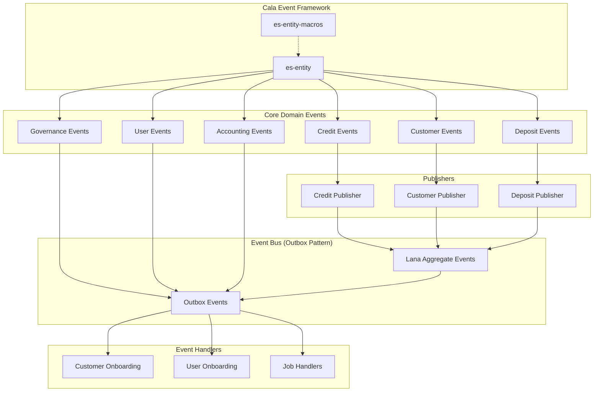

# LANA Bank and Cala Events

This document provides a comprehensive list of all events in the LANA Bank system and Cala framework, both public and private.

## Event Architecture

## Cala Event Framework

The Cala library provides the foundation for the event-driven architecture:

- `EsEvent` - A trait/macro for event sourcing that connects events to entity IDs
- Event persistence and serialization using tagged enums
- Event aggregation and distribution mechanisms

## Public Events (from event.rs)

### Core Credit Events (`CoreCreditEvent`)
- `FacilityCreated` - Emitted when a new credit facility is created
- `FacilityApproved` - Emitted when a facility is approved
- `FacilityActivated` - Emitted when a facility becomes active
- `FacilityCompleted` - Emitted when a facility is fully paid off
- `DisbursalExecuted` - Emitted when funds are disbursed
- `FacilityRepaymentRecorded` - Emitted when a payment is received
- `FacilityCollateralUpdated` - Emitted when collateral changes
- `AccrualExecuted` - Emitted when interest is accrued

### Core Customer Events (`CoreCustomerEvent`)
- `CustomerCreated` - Emitted when a new customer is created
- `CustomerAccountStatusUpdated` - Emitted when a customer's account status changes

### Core Deposit Events (`CoreDepositEvent`)
- `DepositInitialized` - Emitted when a deposit is recorded
- `WithdrawalConfirmed` - Emitted when a withdrawal is confirmed

### Governance Events (`GovernanceEvent`)
- `ApprovalProcessConcluded` - Emitted when an approval process is finished

### Core User Events (`CoreUserEvent`)
- `UserCreated` - Emitted when a new user is created
- `UserRemoved` - Emitted when a user is removed

### Outbox Events
- `OutboxEvent` - Generic wrapper for all events in the system
- `PersistentOutboxEvent` - Structure for persisting events with metadata

## Private Events (from entity.rs)

### Chart of Accounts Events (`ChartEvent`)
- `Initialized` - When a chart of accounts is created
- `NodeAdded` - When an account is added to the chart

### Credit Facility Events (`CreditFacilityEvent`)
- `Initialized` - When a credit facility is created
- `ApprovalProcessConcluded` - When approval finishes
- `Activated` - When the facility becomes active
- `DisbursalInitiated` - When disbursal starts
- `DisbursalConcluded` - When disbursal completes
- `InterestAccrualStarted` - When interest starts accruing
- `InterestAccrualConcluded` - When interest accrual period ends
- `CollateralUpdated` - When collateral changes
- `CollateralizationChanged` - When collateral ratio changes
- `PaymentRecorded` - When payment is received
- `OverdueDisbursedBalanceRecorded` - When overdue status is recorded
- `Completed` - When facility is paid off

### Customer Events (`CustomerEvent`)
- `Initialized` - When customer record is created
- `AuthenticationIdUpdated` - When auth info changes
- `KycStarted` - When KYC process begins
- `KycApproved` - When KYC is approved
- `KycDeclined` - When KYC is declined
- `AccountStatusUpdated` - When account status changes
- `TelegramIdUpdated` - When telegram ID changes

### Deposit Events (`DepositEvent`)
- `Initialized` - When a deposit is recorded

### Withdrawal Events (`WithdrawalEvent`)
- `Initialized` - When withdrawal is requested
- `ApprovalProcessConcluded` - When approval completes
- `Confirmed` - When withdrawal is confirmed
- `Cancelled` - When withdrawal is cancelled

### Approval Process Events (`ApprovalProcessEvent`)
- `Initialized` - When process starts
- `Approved` - When approved
- `Denied` - When denied
- `Concluded` - When process concludes

## Event Patterns

The LANA Bank system uses an event-driven architecture with the following components:

1. **Domain Events**: Each core module defines domain-specific events.
2. **Event Sourcing**: Entities maintain state through an append-only log of events.
3. **Event Publishers**: Domain modules publish events to a central bus.
4. **Outbox Pattern**: Ensures reliable event delivery across services.
5. **Event Handlers**: Process events to trigger side effects or maintain derived state.

This architecture follows the Command Query Responsibility Segregation (CQRS) pattern, where commands update state via events, while queries read from optimized read models.